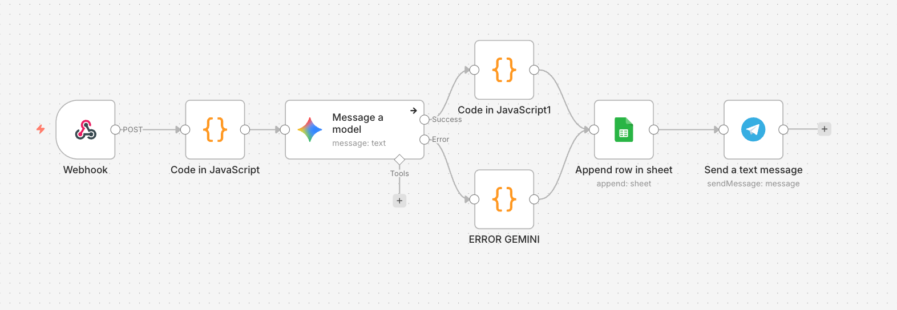

# AI Lead Classification System (n8n Workflow)

🇺🇸 English | 🇺🇦 [Українська](README_UA.md)

## Overview

This project demonstrates an **AI workflow for lead processing and classification**, built using **n8n**.

The workflow receives lead data via a webhook, processes it using JavaScript, analyzes the client message with **Google Gemini AI**, stores the result in **Google Sheets**, and sends notifications via **Telegram**.

The project was created as a **learning / demo automation system**.

---

## Workflow Architecture



The workflow consists of the following stages:

1. **Webhook** — receiving lead data  
2. **JavaScript data processing** — structuring data and determining lead priority  
3. **AI classification (Google Gemini)** — analyzing the client's message  
4. **AI response parsing** — extracting the category from the JSON response  
5. **Google Sheets** — storing processed data  
6. **Telegram notification** — notifying about a new lead

---

## How the System Works

### 1. Webhook

The workflow receives lead data via a webhook.

Example payload:

```json
{
  "name": "John Doe",
  "email": "john@email.com",
  "phone": "+123456789",
  "source": "facebook",
  "message": "How much does your service cost?"
}
```

---

### 2. Data Processing (JavaScript)

The **Code node**:

- extracts required data from the webhook
- determines lead priority
- creates a timestamp

Priority logic:

- **Facebook / Instagram → High**
- **Website → Medium**
- **Other sources → Low**

---

### 3. AI Message Classification

The client message is sent to **Google Gemini**, which returns a JSON response containing the message category.

Categories:

- **PRICE** — questions about cost  
- **SUPPORT** — technical issues  
- **INFO** — general information  
- **OTHER** — other requests  

Example AI response:

```json
{
  "category": "PRICE"
}
```

---

### 4. AI Response Parsing

A JavaScript node parses the JSON response from Gemini and extracts the message category.

---

### 5. Error Handling

If the AI does not return a valid response, the workflow uses a **fallback mechanism**:

- category → **Unknown**
- the **error** field is recorded

---

### 6. Data Storage

Processed lead data is stored in **Google Sheets**.

Stored fields include:

- name  
- email  
- phone  
- source  
- priority  
- message  
- timestamp  
- category  
- error (if an error occurred)

---

### 7. Telegram Notification

After processing the lead, a notification is sent to **Telegram**.

Example message:

```
🔔 New Lead!

Priority: 🔥 High
Name: John Doe
Email: john@email.com
Phone: +123456789
Source: facebook
Message: How much does your service cost?
Time: 12.04.2026 14:21
```

---

## Technologies Used

- **n8n** — automation workflow platform  
- **Webhooks** — receiving leads  
- **JavaScript (Code node)** — data processing  
- **Google Gemini AI** — AI message classification  
- **Google Sheets API** — data storage  
- **Telegram Bot API** — notifications  

---

## Possible Improvements

- CRM integration  
- duplicate lead detection  
- automatic lead assignment to managers  
- retry logic for AI requests  
- analytics dashboard  

---

## Setup Notes

This workflow is a **template version**.

Replace the following values with your own:

- `YOUR_CHAT_ID`
- `YOUR_SPREADSHEET_ID`
