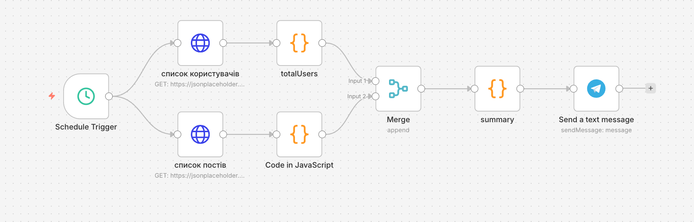

# Daily Report Workflow (n8n)

🇺🇸 English | 🇺🇦 [Українська](README_UA.md)

## Overview

This project demonstrates an **automation workflow for generating daily reports**, built using **n8n**.

The workflow runs automatically on a schedule, retrieves data from an API, processes it using JavaScript, generates a summary report, and sends the report to **Telegram**.

This project was created as a **learning / demo automation system** to demonstrate:

- scheduled automation
- working with HTTP APIs
- data processing with JavaScript
- using the Merge node
- automated reporting

---

## Workflow Architecture



The workflow consists of the following stages:

1. **Schedule Trigger** — automatically starts the workflow every day at **09:00**
2. **HTTP Request (Users)** — retrieves a list of users from the API
3. **HTTP Request (Posts)** — retrieves a list of posts
4. **JavaScript data processing** — calculates statistics
5. **Merge** — combines results from both workflow branches
6. **Summary** — prepares the final report object
7. **Telegram notification** — sends the daily report

---

## How the System Works

### 1. Schedule Trigger

The workflow runs automatically **every day at 09:00** using the **Schedule Trigger** node.

This allows fully automated reporting without manual execution.

---

### 2. Data Retrieval (HTTP Requests)

After the workflow starts, two **HTTP requests** are executed:

1️⃣ Retrieve the list of users  
2️⃣ Retrieve the list of posts  

This example uses a test API:

```
https://jsonplaceholder.typicode.com
```

---

### 3. Data Processing (JavaScript)

#### Node `totalUsers`

Counts the total number of users.

```javascript
const data = $input.all();

return {
  totalUsers: data.length
};
```

---

#### Node `Code in JavaScript`

Calculates:

- total number of posts
- number of posts created by user with `userId = 1`

```javascript
const data = $input.all();

const countPosts = data.length;

const postsUserId = data.filter(item => item.json.userId === 1);

const countUser1 = postsUserId.length;

return {
  countPosts: countPosts,
  countUserId1: countUser1
};
```

---

### 4. Merge

The **Merge node** combines results from two workflow branches.

This allows passing all data into a single stream for further processing.

---

### 5. Report Generation (Summary)

The **summary** node combines all processed data and generates the final report object.

```javascript
const data = $input.all();

const way1 = data[0].json;
const way2 = data[1].json;

return {
  totalUsers: way1.totalUsers,
  countPosts: way2.countPosts,
  countUserId1: way2.countUserId1,
  timestamp: new Date().toISOString(),
  timestampBoss: new Date().toLocaleString('uk-UA',{
    day: '2-digit',
    month: '2-digit',
    year: 'numeric',
    hour: '2-digit',
    minute: '2-digit',
    timeZone: 'Europe/Kyiv'
  })
};
```

---

### 6. Telegram Notification

After processing the data, the workflow sends a **daily report to Telegram**.

Example message:

```
📊 Daily Report

Users: 10
Total posts: 100
Posts from userId 1: 10
Date: 12.04.2026 09:00
```

This allows receiving up-to-date statistics automatically every day.

---

## Technologies Used

- **n8n** — automation workflow platform  
- **Schedule Trigger** — scheduled workflow execution  
- **HTTP Request** — retrieving data from APIs  
- **JavaScript (Code node)** — data processing  
- **Merge Node** — combining workflow branches  
- **Telegram Bot API** — sending reports  

---

## Possible Improvements

- integration with a real database
- storing reports in Google Sheets
- sending reports to Slack
- generating charts and statistics
- building an analytics dashboard

---

## Setup Notes

This workflow is a **demo template**.

To use it:

- configure **Telegram Bot Token**
- specify your **CHAT_ID**
- import the workflow into **n8n**
