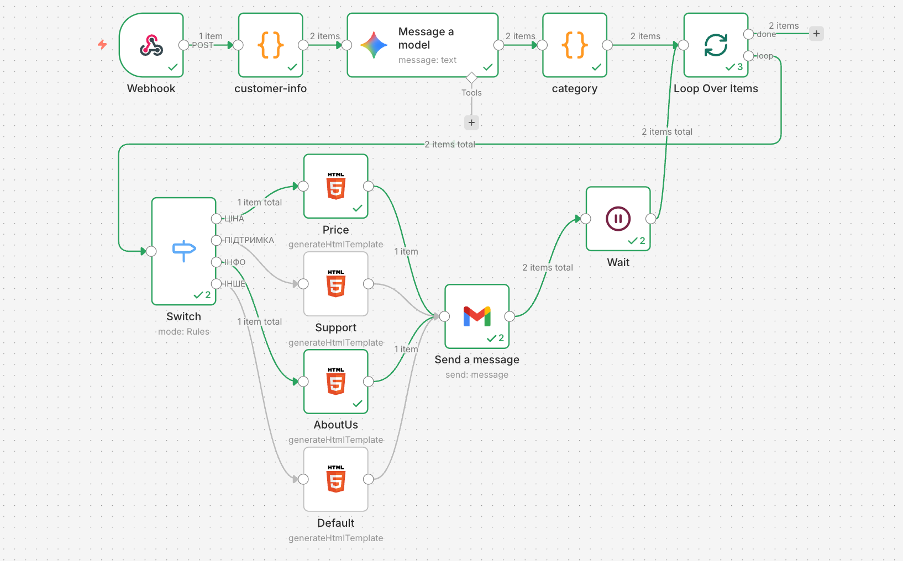

# AI Helpdesk Email Automation (n8n Workflow)

🇺🇦 Українська | 🇺🇸 [English](README_EN.md)

---

## Огляд

Цей проєкт демонструє **AI automation workflow для автоматичної відповіді клієнтам на email**, створений за допомогою **n8n** та **Google Gemini AI**.

Workflow отримує звернення клієнтів через webhook, класифікує їх за допомогою AI, генерує відповідний HTML шаблон відповіді та відправляє email через **Gmail**.

Система також використовує **rate limiting (wait node)** для уникнення масової відправки листів одночасно.

Проєкт створений як **learning / demo AI automation system** для демонстрації:

- AI класифікації звернень
- автоматичних email відповідей
- роботи з шаблонами
- loop processing
- rate limiting
- персоналізації повідомлень

---

## Архітектура Workflow



Workflow складається з наступних етапів:

1. **Webhook** — отримання масиву звернень клієнтів  
2. **customer-info** — перетворення масиву у окремі об'єкти  
3. **Google Gemini AI** — класифікація повідомлення клієнта  
4. **category** — парсинг JSON відповіді від AI  
5. **Loop Over Items** — обробка кожного клієнта окремо  
6. **Switch** — вибір шаблону відповіді залежно від категорії  
7. **HTML Template Generation** — формування відповіді  
8. **Gmail Send Message** — відправка email  
9. **Wait (3 sec)** — затримка між відправками (rate limit)

---

## Як працює система

### 1. Webhook

Workflow отримує дані клієнтів через **Webhook**.

Для тестування використовується:

```
https://reqbin.com
```

Формат даних:

```json
{
  "body": [
    {
      "name": "John Doe",
      "phone": "123456789",
      "email": "john@email.com",
      "source": "website",
      "message": "How much does your service cost?"
    }
  ]
}
```

---

### 2. Обробка масиву (customer-info)

Node розбиває масив на окремі об'єкти.

```javascript
const data = $input.all();

const result = data.flatMap(item =>
  item.json.body.map(itemBody => ({
    name: itemBody.name,
    phone: itemBody.phone,
    email: itemBody.email,
    source: itemBody.source,
    message: itemBody.message
  }))
);

return result;
```

---

### 3. AI класифікація

Повідомлення клієнта передається у **Google Gemini AI**.

AI визначає категорію:

- **ЦІНА**
- **ПІДТРИМКА**
- **ІНФО**
- **ІНШЕ**

Prompt:

```
Ти класифікуєш повідомлення клієнта.

Категорії:
ЦІНА
ПІДТРИМКА
ІНФО
ІНШЕ

Поверни лише JSON:
{
 "category": "ЦІНА"
}
```

---

### 4. Парсинг відповіді

Node **category** витягує категорію з JSON.

```javascript
const gemini = $json.content.parts[0].text;
const parseText = JSON.parse(gemini);

return {
  category: parseText.category
};
```

---

### 5. Loop обробка

Node **Loop Over Items** обробляє кожного клієнта окремо.

Це дозволяє:

- уникнути масової відправки
- контролювати навантаження
- додати затримку між email

---

### 6. Вибір шаблону (Switch)

Node **Switch** обирає HTML шаблон залежно від категорії:

- **ЦІНА** → прайс  
- **ПІДТРИМКА** → контакти підтримки  
- **ІНФО** → інформація про компанію  
- **ІНШЕ** → стандартна відповідь  

---

### 7. HTML шаблон (Default)

```html
<h2>Привіт, {{ $('customer-info').item.json.name }}</h2>
<p>Дякуємо за ваше звернення. Ми отримали ваше повідомлення:</p>
<blockquote>{{ $('customer-info').item.json.message }}</blockquote>
<p>Наш менеджер зв'яжеться з вами найближчим часом.</p>
<p>З повагою,<br>Команда підтримки</p>
```

---

### 8. Відправка email

Node **Gmail** відправляє повідомлення:

- **To:** email клієнта  
- **Subject:** персоналізований  
- **Message:** HTML шаблон  

---

### 9. Rate Limiting

Node **Wait (3 seconds)** додає затримку між відправками.

Це потрібно щоб:

- уникнути блокування Gmail
- не перевищити ліміти API
- відправляти листи поступово

---

## Використані технології

- **n8n** — automation workflow platform  
- **Webhook** — отримання звернень  
- **JavaScript (Code nodes)** — обробка даних  
- **Google Gemini AI** — класифікація повідомлень  
- **Switch Node** — логіка вибору шаблонів  
- **Gmail API** — відправка email  
- **Loop + Wait** — контроль навантаження  

---

## Можливі покращення

- збереження звернень у CRM
- AI генерація відповіді (не тільки шаблон)
- підтримка мультимовності
- інтеграція з Slack або Telegram
- аналітика звернень

---

## Setup Notes

Цей workflow є **демонстраційним прикладом AI email automation**.

Для використання потрібно:

- підключити **Google Gemini API**
- налаштувати **Gmail integration**
- імпортувати workflow у **n8n**
