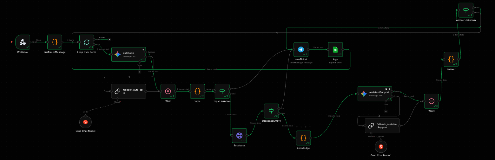

# AI Customer Support System with Knowledge Base (n8n Workflow)

🇺🇸 English | 🇺🇦 [Українська](README_UA.md)

---

## Overview

This project demonstrates an **AI automation workflow for handling customer support requests**, built using **n8n**, **LLMs (Gemini / Groq)**, and **Supabase** as a knowledge base.

The system automatically:

- receives customer requests  
- determines the request topic  
- retrieves relevant information from a knowledge base  
- generates a response  
- or creates a support ticket for a manager  

Additionally, the system includes:

- AI fallback logic  
- handling of unknown topics  
- request logging  
- rate limiting  

This project was created as a **learning / demo AI support system** to demonstrate:

- AI routing (topic classification)
- knowledge base integration
- fallback models
- automated support workflows
- ticketing logic

---

## Workflow Architecture



The workflow consists of the following stages:

1. **Webhook** — receiving an array of customer requests  
2. **customerMessage** — normalizing data and generating a chatId  
3. **Loop Over Items** — processing each request individually  
4. **autoTopic (AI)** — detecting the request topic  
5. **Fallback AI (Groq)** — backup model  
6. **topic parser** — extracting the topic  
7. **topicUnknown check**
   - unknown → create ticket  
   - known → search knowledge base  
8. **Supabase (Knowledge Base)** — search by topic  
9. **supabaseEmpty check**
   - empty → create ticket  
   - found → build knowledge  
10. **assistantSupport (AI)** — generate response  
11. **Fallback AI (Groq)** — backup response  
12. **answer parser** — extract answer  
13. **answerUnknown check**
   - fallback → create ticket  
   - success → return response  
14. **Telegram (newTicket)** — create support ticket  
15. **Google Sheets (logs)** — store logs  

---

## How the System Works

### 1. Webhook

The workflow receives an array of customer requests:

```json
[
 {
  "name": "vlad",
  "message": "What is the delivery cost?"
 },
 {
  "name": "pavlo",
  "message": "I need to return a product..."
 }
]
```

---

### 2. Data Normalization

Node **customerMessage**:

```javascript
const crypto = require('crypto');

const data = $input.all();

const customerInfo = data.flatMap(item =>
  item.json.body.map(bodyItem => ({
    chatId: crypto.randomUUID(),
    name: bodyItem.name,
    message: bodyItem.message,
    timestamp: new Date().toISOString()
  }))
);

return customerInfo;
```

---

### 3. AI Topic Detection

Node **autoTopic** determines the topic.

Categories:

- pricing  
- delivery  
- returns  
- unknown  

Prompt:

```
You determine the topic of a customer request.

Respond with only one word.
```

Fallback: **Groq model**

---

### 4. Topic Parsing

```javascript
const content = $json.content?.parts[0]?.text;
const text = $json.text;

// Normalize for DB lookup and avoid errors
const topic = (content || text || 'unknown').toLowerCase().trim();

return { topic };
```

---

### 5. Unknown Topic

If:

```
topic = unknown
```

→ a **Telegram ticket is created**

---

### 6. Knowledge Base Search

Request to **Supabase**:

```
GET /rest/v1/{table}?topic=eq.{topic}
```

---

### 7. Result Check

If no data is found:

→ create ticket  

If data is found:

→ build knowledge  

---

### 8. Knowledge Preparation

```javascript
const item = $input.first().json;

return {
  knowledge: `Topic: ${item.topic}\nContent: ${item.content}`
};
```

---

### 9. AI Response Generation

Node **assistantSupport**:

- uses the knowledge base  
- responds only based on it  

Fallback: **Groq model**

---

### 10. Answer Validation

If the response contains:

```
manager / unknown / don't know
```

→ create ticket  

Otherwise → return response  

---

### 11. Ticket Creation

Telegram message:

```
New Ticket!
ID: {{chatId}}
Customer: {{name}}
Message: {{message}}
```

---

### 12. Logging

Google Sheets stores:

- id  
- name  
- message  
- timestamp  

---

## Technologies Used

- **n8n** — automation platform  
- **Google Gemini AI** — primary model  
- **Groq AI** — fallback model  
- **Supabase** — knowledge base  
- **Webhook** — data input  
- **JavaScript** — processing  
- **Telegram Bot API** — ticketing  
- **Google Sheets API** — logging  

---

## Possible Improvements

- multilingual support  
- vector search (embeddings)  
- CRM integration  
- SLA tracking  
- AI confidence scoring  

---

## Setup Notes

This workflow is a **demo AI support system**.

To use it:

- configure **Gemini / Groq API**
- create a **Supabase knowledge base table**
- connect a **Telegram Bot**
- configure **Google Sheets**
- import the workflow into **n8n**
