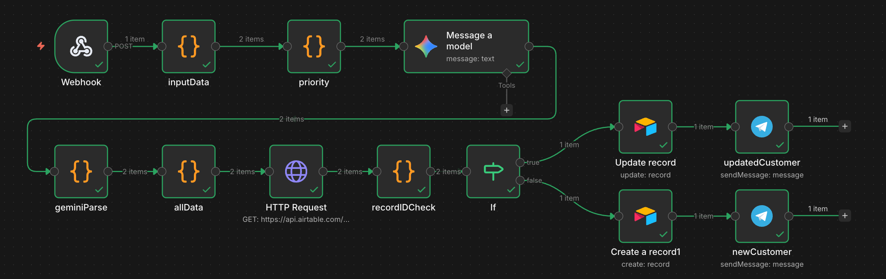

# Airtable CRM Lead Management (n8n Workflow)

🇺🇸 English | 🇺🇦 [Українська](README_UA.md) 

## Overview

This project demonstrates an **automation workflow for managing leads in a CRM**, built using **n8n** and **Airtable**.

The workflow receives leads via a webhook, processes them using JavaScript, determines lead priority, classifies the customer request using **Google Gemini AI**, checks if the lead already exists in the CRM, and performs **record creation or update in Airtable**.

The system also sends notifications to **Telegram** when:

- a new customer is created
- an existing customer record is updated

This project was created as a **learning / demo CRM automation system** to demonstrate:

- webhook automation
- array data processing
- AI request classification
- lead deduplication
- CRM integration
- automated notifications

---

## Workflow Architecture



The workflow consists of the following stages:

1. **Webhook** — receiving an array of leads from an external service  
2. **inputData** — converting the array into individual lead objects  
3. **priority** — calculating lead priority and creating a timestamp  
4. **Google Gemini AI** — analyzing the customer's message  
5. **geminiParse** — parsing the JSON response from the AI model  
6. **allData** — combining all lead information into one object  
7. **HTTP Request (Airtable API)** — checking if the lead already exists in the CRM  
8. **recordIDCheck** — verifying if a record was found  
9. **IF Condition**
   - **True** → update existing record  
   - **False** → create a new record  
10. **Airtable Update / Create** — updating or creating a lead in the CRM  
11. **Telegram Notification** — sending an alert about a new or updated customer

---

## How the System Works

### 1. Webhook

The workflow receives lead data through a **Webhook**.

For testing purposes, the service used is:

```
https://reqbin.com
```

The webhook accepts an array of objects:

```json
{
 "body": [
   {
     "name": "John Doe",
     "phone": "123456789",
     "email": "john@email.com",
     "source": "facebook",
     "message": "How much does your service cost?"
   }
 ]
}
```

---

### 2. Array Data Processing

The **inputData** node extracts objects from the array and converts them into individual records.

```javascript
const data = $input.all();

const dataBody = data.flatMap(item =>
  item.json.body.map(itemBody => ({
    name: itemBody.name,
    phone: itemBody.phone,
    email: itemBody.email,
    source: itemBody.source,
    message: itemBody.message
  }))
);

return dataBody;
```

---

### 3. Priority Calculation

The **priority** node determines the lead priority based on the source.

Logic:

- **Facebook / Instagram → High**
- **Website → Medium**
- **Other sources → Low**

```javascript
const source = $json.source;

const priority = source === "facebook" | source === "instagram"
  ? "High"
  : source === "website"
    ? "Medium"
    : "Low";

const timestamp = new Date().toISOString();

return {
  priority: priority,
  timestamp: timestamp
};
```

---

### 4. AI Request Classification

The customer message is analyzed using **Google Gemini AI**.

The AI determines the category of the request:

- **PRICE** — questions about cost
- **SUPPORT** — technical issues
- **INFO** — general information
- **OTHER** — other requests

Prompt:

```
You classify customer requests only into the following categories:

PRICE
SUPPORT
INFO
OTHER

Respond ONLY in valid JSON format:

{
 "category": "PRICE"
}
```

---

### 5. AI Response Parsing

The **geminiParse** node extracts the category from the AI response.

```javascript
const gemini = $json.content.parts[0].text;
const geminiParse = JSON.parse(gemini);

return {
  category: geminiParse.category
};
```

---

### 6. Data Aggregation

The **allData** node builds the complete lead object.

```javascript
return {
  name: $('inputData').item.json.name,
  email: $('inputData').item.json.email,
  phone: $('inputData').item.json.phone,
  source: $('inputData').item.json.source,
  message: $('inputData').item.json.message,
  priority: $('priority').item.json.priority,
  category: $("geminiParse").item.json.category,
  timestamp: $("priority").item.json.timestamp
};
```

---

### 7. Duplicate Check

The workflow performs an **HTTP Request to the Airtable API**.

Parameter used:

```
filterByFormula
```

Formula:

```
AND({Email} = "{{ $json.email }}", {Phone} = {{ $json.phone }})
```

This checks whether the lead already exists in the CRM.

---

### 8. Record ID Check

The **recordIDCheck** node determines if a record exists.

```javascript
const records = $json.records;

return {
  exist: records.length > 0,
  recordId: records.length > 0 ? records[0].id : null
};
```

---

### 9. Conditional Logic

The **IF** node checks:

```
recordId is not empty
```

---

#### If the record exists

- the record is **updated in Airtable**
- the status is changed to:

```
InProgress
```

- a Telegram notification is sent:

```
🔔 UPDATED CUSTOMER INFORMATION
```

---

#### If the record does not exist

- a **new record is created in Airtable**
- a Telegram notification is sent:

```
🔔 NEW CUSTOMER
```

---

### 10. CRM Data Storage

The following fields are stored in **Airtable**:

- Name
- Email
- Message
- Status
- Timestamp
- Phone
- Source
- Priority
- Category

---

## Technologies Used

- **n8n** — automation workflow platform  
- **Webhook** — receiving leads  
- **JavaScript (Code nodes)** — data processing  
- **Google Gemini AI** — AI request classification  
- **Airtable API** — CRM database  
- **HTTP Request** — Airtable integration  
- **Telegram Bot API** — notifications  

---

## Possible Improvements

- lead scoring system
- automatic lead assignment to managers
- analytics dashboard for leads
- automated follow-up messages

---

## Setup Notes

This workflow is a **demonstration example of CRM automation**.

To run it, you need to:

- configure an **Airtable API Token**
- create an **Airtable Base**
- connect a **Telegram Bot**
- import the workflow into **n8n**
