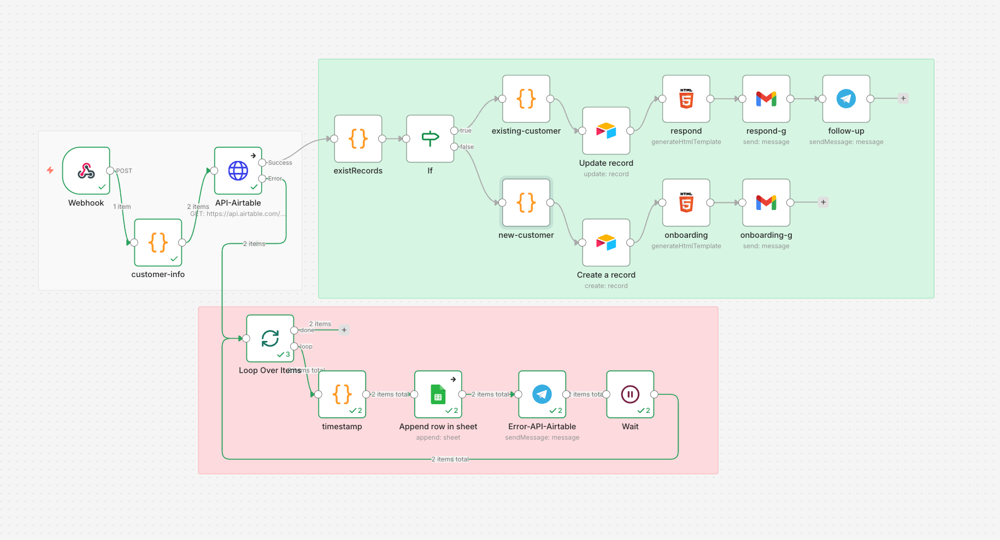

# Customer Onboarding Automation (n8n Workflow)

🇺🇦 Українська | 🇺🇸 [English](README_EN.md)

---

## Огляд

Цей проєкт демонструє **automation workflow для онбордингу клієнтів**, створений за допомогою **n8n** та **Airtable**.

Система отримує дані клієнтів через webhook, перевіряє їх на наявність у CRM, та автоматично:

- створює нового клієнта або оновлює існуючого  
- відправляє email клієнту  
- повідомляє менеджера через Telegram  
- обробляє помилки через fallback систему  

Проєкт створений як **learning / demo CRM onboarding automation system** для демонстрації:

- CRM automation
- дедуплікації лідів
- error handling
- fallback логіки
- email automation
- multi-branch workflow

---

## Архітектура Workflow



Workflow складається з наступних етапів:

1. **Webhook** — отримання масиву клієнтів  
2. **customer-info** — перетворення масиву у окремі об'єкти  
3. **HTTP Request (Airtable API)** — перевірка існування клієнта  
4. **Error Handling Flow** — fallback у разі помилки API  
5. **existRecords** — перевірка наявності запису  
6. **IF Condition**
   - **True** → існуючий клієнт  
   - **False** → новий клієнт  
7. **Airtable Update / Create** — оновлення або створення запису  
8. **Email Automation (Gmail)** — відправка листа клієнту  
9. **Telegram Notification** — повідомлення менеджера  
10. **Wait + Loop** — контроль обробки помилок

---

## Як працює система

### 1. Webhook

Workflow отримує дані клієнтів через **Webhook**.

Для тестування використовується:

```
https://reqbin.com
```

---

### 2. Обробка даних (customer-info)

Node перетворює масив у окремі об'єкти.

```javascript
const data = $input.all();

const body = data.flatMap(item =>
  item.json.body.map(itemBody => ({
    name: itemBody.name,
    phone: itemBody.phone,
    email: itemBody.email,
    source: itemBody.source,
    message: itemBody.message
  }))
);

return body;
```

---

### 3. Перевірка клієнта в CRM

HTTP Request виконує запит до **Airtable API**.

Використовується:

```
filterByFormula
```

```
AND({Email} = "{{ $json.email }}", {Phone} = {{ $json.phone }})
```

---

## Error Handling (Fallback Flow)

Якщо **Airtable API недоступний**:

1. Запускається **Loop Over Items (batch = 1)**
2. Генерується **timestamp**
3. Дані записуються у **Google Sheets**
4. В поле `ErrorType` записується:

```
API-Airtable
```

5. Відправляється алерт у Telegram:

```
‼️ Error-API-Airtable
```

6. Додається затримка (**Wait node**)
7. Цикл повторюється для кожного клієнта

Навіть якщо Google Sheets не працює — Telegram все одно отримає повідомлення.

---

## 4. Перевірка запису

```javascript
const records = $json.records;

return {
  exist: records.length > 0,
  recordId: records.length > 0 ? records[0].id : null
};
```

---

## 5. Умовна логіка

Node **IF** перевіряє:

```
recordId is not empty
```

---

## Якщо клієнт існує

### Data Preparation

```javascript
const timestamp = new Date().toISOString();

return {
  name: $('customer-info').item.json.name,
  phone: $('customer-info').item.json.phone,
  email: $('customer-info').item.json.email,
  source: $('customer-info').item.json.source,
  message: $('customer-info').item.json.message,
  recordId: $('existRecords').item.json.recordId,
  timestamp: timestamp
};
```

---

### CRM Update

- оновлюється запис у Airtable  
- статус змінюється на:

```
In Progress
```

---

### Email

Клієнту відправляється лист:

- підтвердження, що звернення прийнято в роботу  

---

### Telegram

Менеджер отримує повідомлення:

```
follow-up notification
```

---

## Якщо клієнт новий

### Data Preparation

```javascript
const timestamp = new Date().toISOString();

return {
  name: $('customer-info').item.json.name,
  phone: $('customer-info').item.json.phone,
  email: $('customer-info').item.json.email,
  source: $('customer-info').item.json.source,
  message: $('customer-info').item.json.message,
  timestamp: timestamp
};
```

---

### CRM Create

- створюється новий запис у Airtable  
- статус:

```
New
```

---

### Email (Onboarding)

Клієнту відправляється welcome лист:

- знайомство з компанією  
- базова інформація  

---

## Використані технології

- **n8n** — automation workflow platform  
- **Webhook** — отримання даних  
- **JavaScript (Code nodes)** — обробка  
- **Airtable API** — CRM  
- **HTTP Request** — інтеграція  
- **Google Sheets API** — fallback storage  
- **Gmail API** — email automation  
- **Telegram Bot API** — сповіщення  
- **Loop + Wait** — контроль виконання  

---

## Можливі покращення

- lead scoring система
- автоматичний розподіл клієнтів
- retry механізм для Airtable
- dashboard для аналітики
- SLA tracking для менеджерів

---

## Setup Notes

Цей workflow є **демонстраційним прикладом CRM onboarding automation**.

Для використання потрібно:

- налаштувати **Airtable API Token**
- створити **Airtable Base**
- підключити **Google Sheets**
- налаштувати **Gmail**
- підключити **Telegram Bot**
- імпортувати workflow у **n8n**
