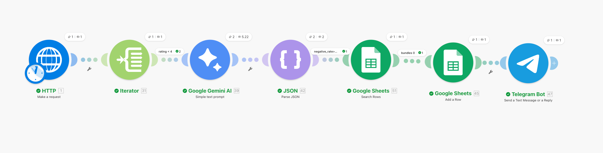

# Ecommerce Review Sentiment AI (Make Automation)

🇺🇸 English | 🇺🇦 [Українська](README_UA.md)

## Overview

This project demonstrates an **AI automation workflow for analyzing product reviews in e-commerce**, built using **Make (Integromat)**.

The system automatically retrieves a list of products via an API, analyzes customer reviews using **Google Gemini AI**, detects negative feedback patterns, and sends an alert to **Telegram** if the negative sentiment ratio exceeds a defined threshold.

The analysis results are stored in **Google Sheets** for monitoring and tracking.

This project was created as a **learning / demo automation system** to demonstrate:

- working with APIs
- AI text analysis
- sentiment analysis
- data filtering
- deduplication
- automated alerts

---

## Workflow Architecture



The workflow consists of the following stages:

1. **Scheduler** — runs the scenario every 180 minutes  
2. **HTTP Request** — retrieves the list of products via API  
3. **Iterator** — converts the product array into individual objects  
4. **Filter (Rating < 4)** — selects products with rating lower than 4  
5. **Google Gemini AI** — analyzes product reviews and determines sentiment  
6. **JSON Parse** — parses the AI response  
7. **Filter (Negative Ratio)** — allows only products with high negative sentiment  
8. **Deduplication (Google Sheets)** — checks if the product was already processed  
9. **Google Sheets Insert** — stores the analysis results  
10. **Telegram Alert** — sends a notification

---

## How the System Works

### 1. Scheduler

The scenario runs **every 180 minutes**.

This allows the system to continuously monitor product reviews without manual execution.

---

### 2. Data Retrieval (HTTP Request)

The system retrieves product data via an API.

For demonstration purposes, a test API is used:

```
https://dummyjson.com/products
```

The API returns a list of products:

```json
{
  "products": [...]
}
```

---

### 3. Iterator

The **Iterator module** converts the `products[]` array into individual objects so that each product can be processed separately.

---

### 4. Rating Filter

A filter allows only products where:

```
rating < 4
```

This ensures the system focuses only on **potentially problematic products**.

---

### 5. AI Review Analysis

Customer reviews are sent to **Google Gemini AI**, which performs **sentiment analysis**.

Prompt used:

```
You are an assistant that analyzes customer reviews of e-commerce products.

Do not include markdown.
Do not include explanations.
Do not wrap the response in code blocks.

Return ONLY valid JSON in this format:

{
 "sentiment": "positive | neutral | negative",
 "negative_ratio": number,
 "summary": "short explanation"
}

Product: {{title}}
Reviews: {{reviews}}
```

---

### 6. JSON Parsing

The **JSON Parse module** converts the Gemini response into structured data.

Extracted fields:

- sentiment
- negative_ratio
- summary

---

### 7. Negative Sentiment Filter

An additional filter passes only products where:

```
negative_ratio > 0.5
```

This means **more than half of the reviews are negative**.

---

### 8. Deduplication

Before storing results, the system checks if the product already exists in the database.

Module used:

**Google Sheets → Search Rows**

Condition:

```
sku = {{sku}}
limit = 1
```

Then a filter is applied:

```
Total number of bundles = 0
```

This ensures the product **has not been processed before**.

---

### 9. Data Storage

If the product is new, the data is saved in **Google Sheets**.

Stored fields include:

- sku
- id
- brand
- price
- title
- ratingReviews
- category
- availabilityStatus
- sentiment
- negative_ratio
- summary

This creates a **dataset of problematic products and negative feedback**.

---

### 10. Telegram Alert

After saving the data, the system sends an **alert to Telegram**.

Example message:

```
⚠️ Negative Product Reviews Detected

Product: iPhone Case
Brand: Apple
Category: accessories
Negative ratio: 0.62

Summary:
Customers complain about poor durability and low quality materials.
```

---

## Technologies Used

- **Make (Integromat)** — automation platform  
- **HTTP Request** — retrieving API data  
- **Iterator** — processing arrays  
- **Google Gemini AI** — sentiment analysis  
- **JSON Parse** — parsing AI responses  
- **Google Sheets API** — storing results  
- **Telegram Bot API** — sending alerts  

---

## Possible Improvements

- integration with real e-commerce APIs
- automatic support ticket creation
- sentiment monitoring dashboard
- Slack notifications
- classification of problem types (quality / delivery / price)

---

## Setup Notes

This scenario is a **demonstration template**.

To run it, you need to:

- configure **Google Gemini API**
- connect **Google Sheets**
- add **Telegram Bot Token**
- specify your `YOUR_CHAT_ID`
- specify your `YOUR_SPREADSHEET_ID`
