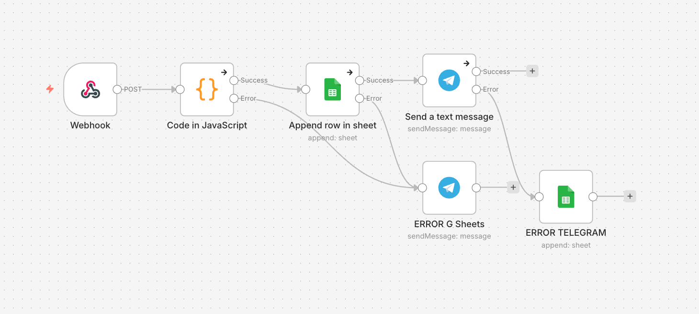

# Lead Capture & Notification System (Демо Workflow)

 🇺🇦 Українська | 🇺🇸 [English version](README_EN.md)

---

## Огляд

Цей проєкт демонструє простий **workflow автоматизації збору та обробки лідів**, створений за допомогою **n8n**.

Workflow отримує ліди через webhook, обробляє та пріоритизує їх за допомогою JavaScript, зберігає в Google Sheets та відправляє сповіщення у Telegram.

⚠️ Цей проєкт створений як **навчальний (learning project) та proof-of-concept**, а не як production-рішення.

Мета проєкту:

- показати автоматизацію обробки лідів
- реалізувати логіку пріоритизації
- виконувати валідацію вхідних даних
- інтегрувати зовнішні сервіси
- реалізувати базову обробку помилок

---

## Архітектура Workflow



Workflow складається з наступних етапів:

1. Webhook отримує дані ліда  
2. JavaScript node обробляє та пріоритизує дані  
3. Лід записується в Google Sheets  
4. Відправляється сповіщення в Telegram  
5. У разі помилки спрацьовує механізм обробки помилок

---

## Покрокова робота системи

### 1. Webhook — отримання даних

Node **Webhook** приймає дані ліда із зовнішніх джерел, наприклад:

- форм на сайті
- маркетингових сервісів
- інтеграцій

Приклад payload:

```json
{
  "name": "John Doe",
  "email": "john@email.com",
  "phone": "+123456789",
  "source": "facebook",
  "message": "I am interested in your service"
}
```

---

### 2. JavaScript Node — обробка та пріоритизація

Node **Code** виконує:

- структуризацію даних
- перевірку обов'язкових полів
- визначення пріоритету ліда
- створення timestamp

Логіка пріоритету:

- **Facebook / Instagram → високий пріоритет**
- **Website → середній**
- **інші джерела → низький**

Приклад коду:

```javascript
const source = $json.body.source;

const priority = source === "facebook" || source === "instagram"
? "Високий"
: source === "website"
? "Середній"
: "Низький";

const priority_telegram = source === "facebook" || source === "instagram"
? "🔥 Високий"
: source === "website"
? "⚡ Середній"
: "📩 Низький";

if (!$json.body.name || !$json.body.email) {
  throw new Error("Відсутні обовʼязкові поля: name або email");
};

return {
  name: $json.body.name,
  email: $json.body.email,
  phone: $json.body.phone,
  source: $json.body.source,
  priority: priority,
  priority_telegram: priority_telegram,
  message: $json.body.message,
  timestamp: new Date().toISOString()
};
```

---

### 3. Google Sheets — збереження ліда

Після обробки лід записується в **Google Sheets**, яка використовується як проста база даних.

У таблиці зберігаються:

- імʼя
- email
- телефон
- джерело
- пріоритет
- повідомлення
- timestamp

Це дозволяє легко переглядати та контролювати всі отримані ліди.

---

### 4. Telegram — сповіщення

Якщо запис у Google Sheets успішний, система відправляє **сповіщення у Telegram**.

Приклад повідомлення:

```
🔔 Новий лід!

Імʼя: John Doe
Email: john@email.com
Телефон: +123456789
Джерело: facebook
Пріоритет: 🔥 Високий
Повідомлення: I am interested in your service
Час: 12.04.2026 14:21
```

Це дозволяє менеджеру швидко реагувати на нові заявки.

---

### 5. Обробка помилок

Workflow містить базову систему обробки помилок.

#### Помилка запису в Google Sheets

Якщо запис у Google Sheets не відбувся, у Telegram надсилається повідомлення з деталями:

```
⚠️ Помилка запису в Google Sheets!

Лід: +123456789
Email: john@email.com
Час: 12.04.2026 14:21
Помилка: <error message>
```

---

#### Помилка відправлення Telegram

Якщо Telegram повідомлення не було відправлено:

- лід все одно залишається записаним у Google Sheets
- у таблиці створюється запис про помилку в окремому полі

Це дозволяє відстежувати помилки сповіщень.

---

## Використані технології

- **n8n** — платформа автоматизації workflow
- **Webhook** — отримання лідів
- **JavaScript (Code Node)** — обробка та пріоритизація
- **Google Sheets** — збереження лідів
- **Telegram Bot API** — сповіщення

---

## Мета проєкту

Цей проєкт створений для практики:

- створення automation workflow
- роботи з API
- обробки помилок
- структуризації даних
- створення логіки пріоритизації лідів

---

## Можливі покращення

У майбутньому систему можна розширити:

- інтеграцією з CRM
- перевіркою лідів на дублікати
- автоматичним призначенням лідів менеджерам
- retry-логікою для помилок сповіщень
- аналітичною панеллю
- більш складним lead scoring
